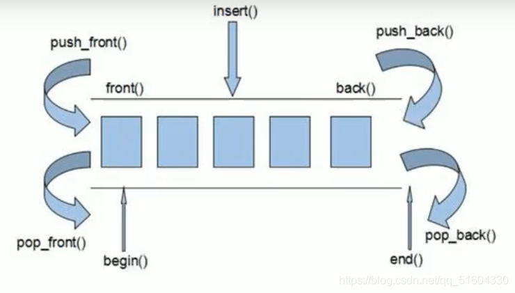
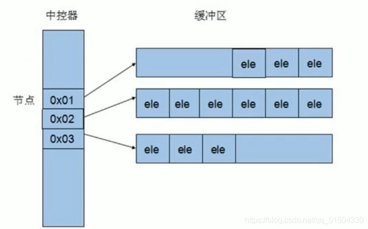

# depue容器
## 功能：
双端数组，可以对头端进行插入删除操作

## deque与vector区别:
+ vector对于头部的插入删除效率低，数据量越大，效率越低
+ deque相对而言，对头部的插入删除速度会比vector快
+ vector访问元素时的速度会比deque快，这和两者内部实现有关


## deque容器工作原理
+ deque内部有个中控器，维护每段缓冲区中的内容，缓冲区中存放真实数据。
+ 中控器维护的是每个缓冲区的地址，使得使用deque时像一片连续的内存空间。


## deque容器——构造函数
```cpp
deque<T> deq;
deque(begin, end);
deque(n, elem);
deque(const deque& deq);

//只读迭代器
const_iterator
```
## deque容器——赋值操作
```cpp
deque& operator = (const deque& deq);
assign(begin, end);
assign(n, elem); 
```
## deque容器——大小操作
```cpp
deque.empty();
deque.size();
deque.resize(int num);
deque.resize(int num, T elem);
```
## deque容器——插入和删除
```cpp
//两端操作
push_back(elem);
push_front(elem);
pop_back();
pop_front();

//指定位置操作
insert(pos, T elem);
insert(pos,int n, T elem);
insert(pos, begin, end);
clear();
erase(beg, end);
erase(pos);
```
## deque容器——数据存取
```cpp
at(int index);
operator [] (int index);
front();
back();
```
## deque容器——排序操作
```cpp
sort(iterator begin, iterator end);
```