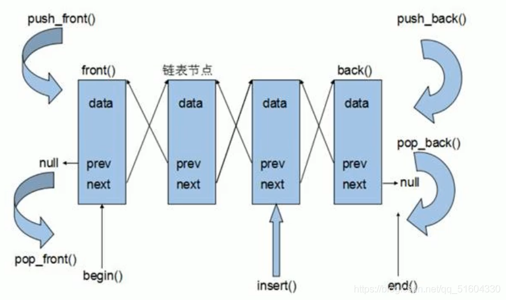

# list容器
链表(list)：是一种物理存储单元上非连续的存储结构，数据元素的逻辑顺序是通过链表中的指针链接来实现的。

链表的组成：链表由一系列结点组成。

结点的组成：一个是存储数据元素的数据域，另一个是存储下一个结点地址的指针域。

SLT中的链表是一个==双向循环链表==。


由于链表的存储方式并不是连续的内存空间，因此链表list中的迭代器只支持前移和后移，属于==双向迭代器==。

### list的优点:

+ 采用动态存储分配，不会造成内存浪费和溢出

+ 链表执行插入和删除操作十分方便，修改指针即可，不需要移动大量元素

### list的缺点:

+ 链表灵活，但是空间(指针域)和时间(遍历)额外耗费较大。

+ list有一个重要的性质，插入操作和删除操作都不会造成原有list迭代器的失效，这在vector是不成立的。
## list容器——构造函数
```cpp
list<T> lst;
list(beg, end);
list(n, elem);
list(const list& lst);
```
## list容器——赋值&交换操作
```cpp
assign(beg, end);
assign(n, elem);
list& operator = (const list& lst);
swap(lst); 
```
## list容器——大小操作
```cpp
size();
empty();
resize(num);
resize(num, elem);
```
## list容器——插入和删除操作
```cpp
push_back(elem);
pop_back();
push_front(elem);
pop_front();
insert(pos, elem);
insert(pos, n, elem);
insert(pos, begin, end);
clear();
erase(beg, end);
erase(pos)
remove(elem);
```
## list容器——数据存取操作
```cpp
front();
back();
```
## list容器——反转和排序操作
```cpp
reverse();    //反转链表
sort();       //链表排序
```