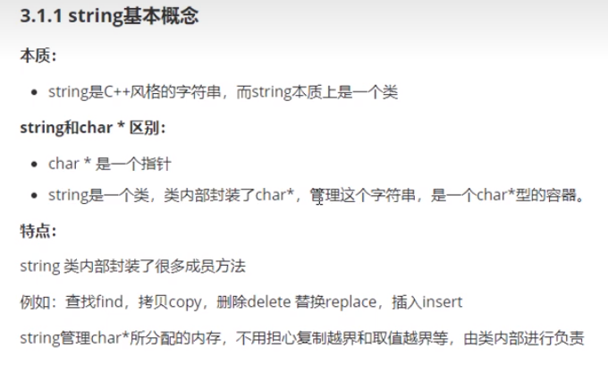

# string容器

## string容器——构造函数
```cpp
string();       //无参构造
string(const char* s);      //有参构造
string(const string& str);  //拷贝构造
string(int n, char c);      //使用n个c初始化字符串
```
## string容器——赋值操作
```cpp
//1、重载运算符   （好用）
string& operator = (const char* s);     
string& operator = (char c);
string& operator = (const string& str);

//2、成员函数
string& assign(const char* s);
string& assign(const char* s, int n);   //将字符串s的前n个字符赋值给string类对象
string& assign(const string& str);
string& assign(int n, char c);      //用n个字符'c'赋值给string类对象
```
## string容器——查找和替换
```cpp
//查找：查找指定字符串是否存在
int find(const string& str, int pos = 0) const; //从pos开始查找，str第一次出现位置
int find(const char* s, int pos = 0) const;     //从pos开始查找，s第一次出现位置
int find(const char* s, int pos, int n) const;  //从pos开始查找，s前n个字符第一次出现位置
int find(const char c, int pos = 0) const;      //从pos开始查找，c第一次出现位置
int rfind(const string& str, int pos = npos) const; //从pos开始查找，str最后一次出现位置
int rfind(const char* s, int pos = npos) const; //从pos开始查找，s最后一次出现位置
int rfind(const char* s, int pos, int n) const; //从pos开始查找，s前n个字符最后一次出现位置
int rfind(const char c, int pos = 0) const;     //从pos开始查找，c最后一次出现位置

//替换：在指定的位置替换字符串
string& replace(int pos, int n, const string& str); //从pos开始的n个字符用str替换
string& replace(int pos, int n, const char* s);     //从pos开始的n个字符用s替换
```
## string容器——字符串比较
```cpp
int compare(const string& str) const;
int compare(const char* s) const;
```
## string容器——字符获取
```cpp
char& operator [] (int n);
char& at(int n);
```
## string容器——插入和删除
```cpp
string& insert(int pos, const char* s);
string& insert(int pos, const string& str);
string& insert(int pos, int n, char c);
string& erase(int pos, int n = npos);
```
## string——子串
```cpp
string substr(int pos = 0; int n = npos) const;
```