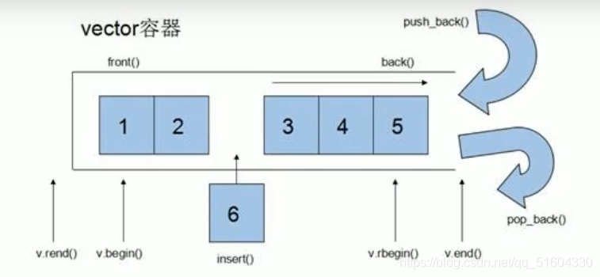

# vector容器
可以动态扩展的数组
## 动态扩展的方法
并不是在原空间之后续接新空间，而是找更大的内存空间，然后将原数据拷贝到新空间，释放原空间。

vector容器的迭代器是支持随机访问的迭代器
## vector容器——构造函数
```cpp
vector<T> v;
vector(v.begin(), v.end());    //将v[ begin(), end() ) 区间中的元素拷贝给本身
vector(n, elem);    //将n个elem拷贝给本身
vector(const vector& v);
```
## vector容器——赋值操作
```cpp
vector& operator = (const vector& vec);
assign(begin, end); //将[ benin, enl )区间中的数据拷贝赋值给本身
assign(n, elem);    //将n个elem拷贝赋值给本身        
```
## vector容器——容量和大小
```cpp
empty();
capacity();
size();
//重新指定容器长度，
//容器变长，默认值(0)填充其位置
//容器变短，末尾超出容器长度的元素被删除
resize(int num);
//重新指定容器长度，
//容器变长，elem填充其位置
//容器变短，末尾超出容器长度的元素被删除    
resize(int num, T elem);
```
## vector容器——插入和删除
```cpp
push_back(elem);
pop_back();

insert(const_iterator pos, elem);
insert(const_iterator pos, int num, elem);

erase(const_iterator pos);
erase(const_iterator start, const_iterator end);

clear();
```
+ 尾插——push_back
+ 尾删——pop_back
+ 插入——insert(位置迭代器)
+ 删除——erase(位置迭代器)
+ 清空——clear
## vector容器——数据存取
```cpp
at(int index);
operator [] ();
front();
back();
```
+ 除了用迭代器获取vector中元素，[]和at也可以
+ front返回容器第一个元素
+ back返回容器最后一个元素
## vector容器——互换容器
```cpp
swap(vector);
```
## vector容器——预留空间
```cpp
reserve(int length);    //容器预留len个元素空间，预留位置不初始化，元素不可访问
```
+ 如果数据量较大，可以一开始利用reserve预留空间