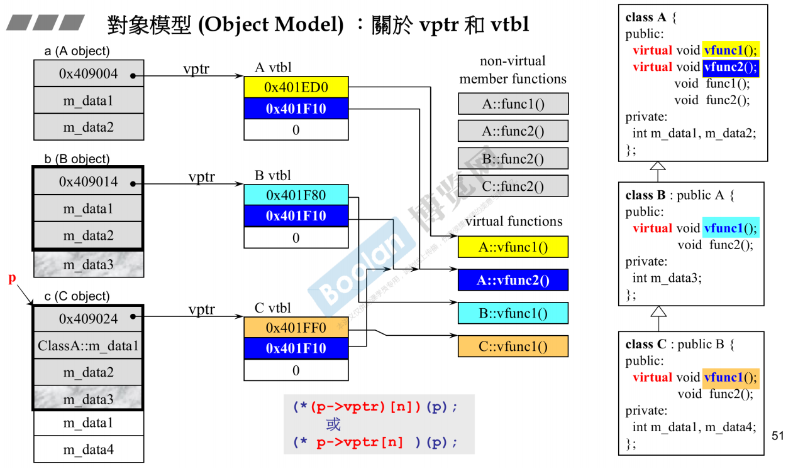
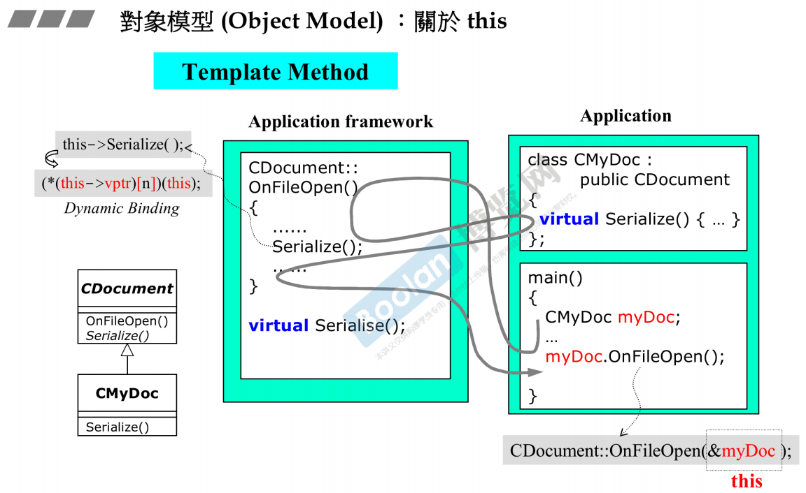
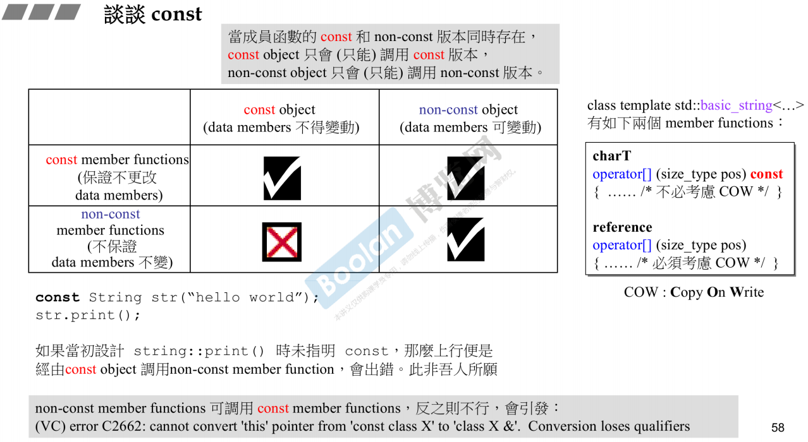

# object model : 
## 关于 vptr & vtbl
### vptr : 虚指针
### vtbl : 虚表

### 虚机制 : 

### 动态绑定(Dynamic Binding) : 虚函数调用
##### 动态绑定三个条件
1. 使用指针调用
2. 调用指针向上转型
3. 调用虚函数
```c 
(*(p->vptr)[n])(p) || (*p->vptr[n])(p)
```
```assemble
call (*(p->vptr)[n])
```  
### 静态绑定 : 普通函数调用
```c
function(p)
``` 
```assemble
call 函数地址
``` 
## 关于this
所有非静态成员函数的默认参数
```c
(*(this->vptr)[n])(this)
```


## const object and const member function

例如 : 
class template std::basic_string<...>
有如下两个 member function
STL : string 类使用同一字符串, 只存储一份实例, 某个对象需要修改时, 进行复制, 在修改(COW : copy on write)
```cpp
charT operator[](size_type pos) const {
    // 不必考虑COW( copy on write )
}
reference operator[](size_type pos) {
    // 必须考虑COW( copy on write )
}
```
##### ==注意== :
当成员函数的const和non-const版本同时存在, 
const object 只会调用 const member function
non-const object 只会调用 non-const member function